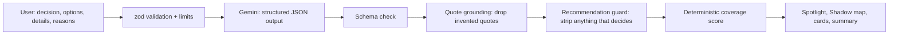

# BlindSpot: see what you're not seeing

> An AI thinking companion that finds the blind spots in your reasoning, asks the questions you skipped, and **never makes the decision for you**.

Built for **PromptWars: THE BLIND SPOT** (Google for Developers × Hack2Skill).

**Live demo:** https://blindspot-s5sh.onrender.com · Click **"Try the internship example"** to run the official problem-statement scenario.

---

## The problem

People decide based on the information that is **most visible** to them. They **overlook important factors**, **rely on unstated assumptions**, and **miss conflicts within their own reasoning**. The challenge: help users examine their reasoning and explore better questions, **without deciding for them**.

## Talk it through: the voice intake

The landing page opens with a **voice agent** (Cartesia-style orb). Tap the mic and BlindSpot interviews you in about a minute: what you're deciding, your options, the key details, and **why you're leaning that way**. It extracts those fields with Gemini (`/api/intake`) and opens the analysis automatically. It speaks with **Gemini native text-to-speech** (`/api/speak`, voice _Puck_) in an energetic, playful, lightly sarcastic tone (it teases the situation, never the person or an option), falling back to the best browser voice. It only asks; any reply that steers the decision is replaced in code, and the interview ends after 6 answers so no one gets stuck. No microphone? Type your answers in the same box, or use the form.

## The idea: Light & Shadow

Your reasoning is a flashlight. What you focused on is lit; everything else sits in shadow, and that's where blind spots live.

BlindSpot reads your decision and your reasons for leaning one way, then shows you:

1. **Spotlight**: your own words highlighted as _focus_, _assumption_, or _conflict_, beside a **Light & Shadow map** of 8 life areas showing which ones your reasoning covers.
2. **Blind spot cards** of three types:
   - **Overlooked**: an important area you didn't consider
   - **Assumption**: an unstated belief your reasoning depends on, quoted from your words
   - **Conflict**: two parts of your own reasoning that pull against each other
3. **Thinking traps.** When a finding reflects a common cognitive bias it is tagged neutrally: e.g. _"Everyone says internships matter"_ → **Bandwagon effect**; leaning on the first or most vivid fact → **Anchoring / Availability**. This is the "decide on what we notice first" problem, named.
4. **One thoughtful question per card.** You mark each one _considered_, _need to find out_, or _not relevant_, and the map lights up as you go. **Re-scan** looks for what's still unexamined.
5. **Exploration score** (0–100) on the dashboard: 60% area coverage + 40% questions reflected on, labelled _"how thoroughly explored, not whether it's right"_.
6. **Save & share** the reasoning summary (Google Cloud Firestore) to revisit it later or show a mentor before deciding.
7. **Reasoning Summary**: before/after map, open questions, what you examined. No verdict. _"BlindSpot doesn't decide. You do."_

## Problem statement → feature map

| Problem statement asks for                                | BlindSpot feature                                                | Code                                                                                                                                                                   |
| --------------------------------------------------------- | ---------------------------------------------------------------- | ---------------------------------------------------------------------------------------------------------------------------------------------------------------------- |
| Decisions based on the _most visible information_         | Spotlight highlights + Light & Shadow coverage map               | [`shared/coverage.ts`](shared/coverage.ts), [`ShadowMap.tsx`](client/src/components/ShadowMap.tsx), [`HighlightedText.tsx`](client/src/components/HighlightedText.tsx) |
| _Overlook important factors_                              | **Overlooked** cards for areas left in shadow                    | [`server/engine/prompt.ts`](server/engine/prompt.ts), [`BlindSpotCard.tsx`](client/src/components/BlindSpotCard.tsx)                                                   |
| _Rely on unstated assumptions_                            | **Assumption** cards quoting the user's own words                | same + [`server/engine/quotes.ts`](server/engine/quotes.ts)                                                                                                            |
| _Fail to recognize conflicts within their own reasoning_  | **Conflict** cards showing statement A vs statement B            | same                                                                                                                                                                   |
| _Explore questions that lead to a more informed decision_ | One open question per finding, reflection, re-scan               | [`client/src/App.tsx`](client/src/App.tsx)                                                                                                                             |
| _Must not make the decision for the user_                 | **Recommendation guard** enforced in code + verdict-free summary | [`server/engine/guard.ts`](server/engine/guard.ts), [`Summary.tsx`](client/src/components/Summary.tsx)                                                                 |
| Official example: internship decision                     | One-click **internship example**                                 | [`client/src/lib/sample.ts`](client/src/lib/sample.ts)                                                                                                                 |

## How it works



- **One Gemini call per scan** using structured output (`responseSchema`), so the AI returns typed JSON rather than chat text.
- **AI for understanding, code for guarantees.** Gemini finds assumptions, conflicts and gaps. Deterministic, unit-tested code then:
  - **grounds quotes**: a highlight is shown only if those exact words appear in the user's input;
  - **guards against verdicts**: any question that recommends a choice is dropped, and prescriptive sentences are stripped from insights. The UI tells the user when this happened;
  - **computes coverage** over a fixed list of 8 areas, so the map is explainable and testable rather than an AI opinion.
- **Focus** is grounded in the user's _reasons_ only, which shows what they actually rely on rather than everything they mentioned.

## Google services

| Service                          | Use                                                                                                                                                                                                                                                |
| -------------------------------- | -------------------------------------------------------------------------------------------------------------------------------------------------------------------------------------------------------------------------------------------------- |
| **Gemini API** (`@google/genai`) | Core reasoning analysis with structured JSON output, system instructions, and an ordered **model fallback** (`gemini-3.5-flash-lite → gemini-3.1-flash-lite → gemini-3.5-flash → gemini-2.5-flash-lite`) so peak-demand 503s don't break a session |
| **Google Cloud Run ready**       | Multi-stage `Dockerfile` (non-root, prod deps only); `/api/health` for health checks                                                                                                                                                               |

## Quality, security, accessibility

- **Code quality:** TypeScript strict on client and server, one shared contract (`shared/`), small pure functions, ESLint + Prettier, CI on every push.
- **Testing:** 104 Vitest tests covering the guard, coverage, quote grounding, schema validation, cache, model fallback, the API (security headers, 400/413/429/502), and the voice-intake rules, and the full UI flow (including a no-microphone path) with **axe-core** accessibility checks. Run `npm test`.
- **Security:** API key server-side only; zod input validation with length limits; 20 KB body limit; per-IP rate limiting; Helmet with strict CSP; user text sent to the model as JSON data with an explicit prompt-injection rule; errors never leak internals. See [SECURITY.md](SECURITY.md).
- **Accessibility:** semantic landmarks, skip link, labelled fields, keyboard-only flow, focus moved to new results, `aria-live` status and alerts, highlights carry **text labels** (not colour alone), the map has a full text list alternative, light/dark themes, `prefers-reduced-motion`.
- **Design:** editorial paper-and-ink system (design tokens, one amber accent, serif display + mono labels), light/dark themes, subtle Motion reveals that respect `prefers-reduced-motion`.
- **Efficiency:** gzip compression; dashboard and summary are lazy-loaded (app code ≈ 8 KB gzipped, React/Motion in separately cached vendor chunks); immutable asset caching; `maxOutputTokens` caps; one model call per scan, in-memory TTL cache for repeated inputs, coverage recomputed instantly in the browser with the same shared function, hand-drawn SVG map (no chart library), ~100 KB gzipped JS, immutable cached assets.

## Run locally

```bash
npm install
cp .env.example .env   # add GEMINI_API_KEY from https://aistudio.google.com/apikey
npm run build && npm start   # http://localhost:8080
```

Development: `npm run dev:server` and `npm run dev:client` (Vite proxies `/api`).
Checks: `npm run lint`, `npm run typecheck`, `npm test`.

## Deploy

- **Render:** Docker deploy. Set `GEMINI_API_KEY` (and optionally `FIRESTORE_SERVICE_ACCOUNT`) in the dashboard.
- **Cloud Run:** `gcloud run deploy blindspot --source . --set-env-vars GEMINI_API_KEY=...`

## Assumptions

- The user has already formed a leaning; examining _why_ is where blind spots show up.
- Eight life areas (academics, money, learning, long-term future, health/time, people affected, risk/reversibility, alternatives) are broad enough for most personal and career decisions.
- Nothing is stored unless the user explicitly clicks **Save & get a share link**; saved summaries contain only the decision, coverage and reflections, behind an unguessable id, and expire after 30 days.
- BlindSpot is a thinking aid, not professional (medical, legal, financial) advice.

## Project structure

```
shared/                    contracts used by both sides (no duplication)
  areas.ts                 8 life areas, finding types, cognitive biases, labels
  schema.ts                zod schemas + types for every API request/response
  coverage.ts              Light & Shadow coverage + exploration score (pure, tested)
  voice.ts                 greeting, closing line, instant fillers
server/
  index.ts                 entry: env → config → app.listen, warms the voice cache
  config.ts                validated configuration (API key, model fallback lists, port)
  app.ts                   Express app: helmet/CSP, permissions policy, gzip, rate limits
  routes/                  analyze · intake · speak (thin: validate → engine → respond)
  engine/
    analyze.ts             pipeline: model → schema check → quote grounding → guard → coverage
    intake.ts              voice interviewer turn logic (turn limit, no-advice reply guard)
    prompt.ts              system prompt + user prompt builder (input as JSON data)
    guard.ts               recommendation guard: enforces "never decide" in code
    quotes.ts              drops any quote the user did not actually write
    gemini.ts              Gemini client with ordered model fallback + backoff pass
    tts.ts                 Gemini TTS: cached WAV + streamed PCM
    schemas.ts             Gemini structured-output schemas
    cache.ts               TTL cache for repeated requests
  tests/                   API, engine and config tests (supertest + vitest)
client/src/
  App.tsx                  shell: layout, live regions, lazy-loaded stages
  hooks/useBlindSpot.ts    all session state (views stay presentational)
  views/                   LandingView · DashboardView (code-split)
  components/              VoiceAgent, DecisionForm, ShadowMap, BlindSpotCard, Kpis, Summary…
  lib/                     api client, speech (Web Speech + Web Audio), highlighting, sample
  tests/                   UI flow, voice (no-mic path), axe accessibility, pure helpers
```
